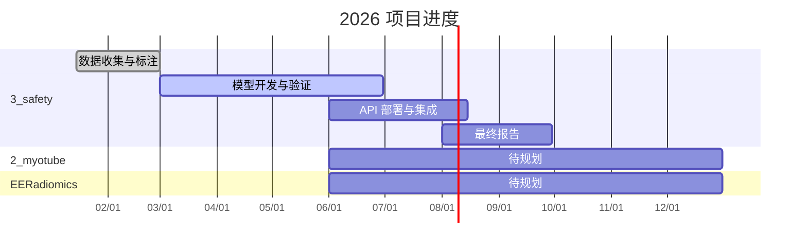

# 🎯 Pulse – 项目仪表盘

> 多项目进度管理 · 自动化周报 · 一键汇报材料

---

## 📊 项目状态一览

| 项目 | 状态 | 最近活动 | 进度 | 链接 |
|------|------|----------|------|------|
| **3_safety** – 安全性评估 | 🟢 进行中 | 2026-05 | ▓▓▓▓▓▓░░░░ 60% | [详情](projects/3_safety.md) |
| **2_myotube** – 肌管分析 | 🟡 待更新 | — | — | *即将接入* |
| **EERadiomics** – 影像组学 | 🟡 待更新 | — | — | *即将接入* |
| **5_vAssay** – 虚拟实验 | 🟡 待更新 | — | — | *即将接入* |
| **omics** – 多组学分析 | 🟡 待更新 | — | — | *即将接入* |

!!! tip "如何更新项目状态"
    编辑 `projects/<name>/meta.yaml` 中的 `status` 字段，运行 `make docs` 即可刷新。

---

## 📅 最近汇报

| 类型 | 期数 | 日期 | 链接 |
|------|------|------|------|
| 周报 | W26 | 06/22 – 06/28 | [查看](reports/weekly/2026-W26.md) |

---

## 🏗️ 项目甘特图



---

## ⚡ 快速命令

```bash
make serve          # 本地预览文档站 http://localhost:8000
make weekly         # 自动生成本周周报
make deck WEEK=W19  # 生成 PPT
make deploy         # 部署到 GitHub Pages
```

---

<small>由 [Pulse](https://github.com/HitJay/pulse) 自动生成 · 基于 MkDocs Material</small>
