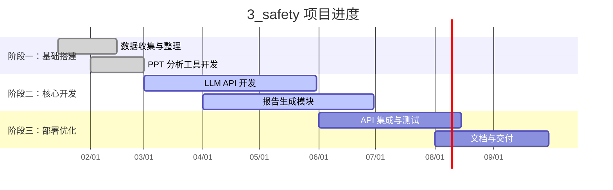

# 🛡️ 3_safety – 靶点安全性评估系统

| 属性 | 值 |
|------|------|
| **状态** | 🟢 进行中 |
| **负责人** | QYJI |
| **源码仓库** | [HitJay/safety](https://github.com/HitJay/safety) |
| **本地路径** | `/home/QYJI/das/3_safety` |
| **启动时间** | 2026-01 |
| **目标完成** | 2026-09 |

---

## 📝 项目简介

基于大语言模型（LLM）的靶点安全性文献分析与报告自动生成系统。通过调用本地部署的 Qwen3 模型，自动解析 PPT、文献数据，生成安全性评估报告。

### 技术栈

- **后端 API**：`landscape_report_api.py`（FastAPI / Flask）
- **LLM 推理**：vLLM + Qwen3-0.6B / Qwen3-8B
- **工具集**：PPT 分析器、Excel 处理、基因靶点文件生成
- **数据库**：本地 SQLite / 文件数据库

---

## 🎯 里程碑



---

## 📈 进度更新

<!-- 按时间倒序记录，最新的在前面 -->

### 2026-05 (W19)

- 持续优化 landscape report API
- vLLM Qwen3-8B 服务稳定运行
- 测试脚本完善（test_api.py、evaluate_predictions.py）

### 2026-04

- 完成 PPT 分析器（ppt_analyzer.py）
- Excel 工具优化（excel_utils.py）
- 基因靶点文件生成脚本完成

### 2026-03

- 初始化项目结构
- 部署 vLLM 推理服务（Qwen3-0.6B / 8B）
- 第一版 API 上线

---

## 📁 关键文件

```
3_safety/
├── landscape_report_api.py      ← 主 API 入口
├── vllm_Qwen3_8B.sh             ← vLLM 启动脚本
├── utils/
│   ├── ppt_analyzer.py          ← PPT 解析
│   ├── excel_utils.py           ← Excel 处理
│   ├── generate_gene_target_files.py
│   └── txt_to_ppt.py            ← 报告生成 PPT
└── test/
    ├── test_api.py              ← API 测试
    └── evaluate_predictions.py  ← 预测评估
```

---

## 🔗 相关资源

- 结构化元数据：[`projects/3_safety/meta.yaml`](https://github.com/HitJay/pulse/blob/main/projects/3_safety/meta.yaml)
- 里程碑数据：[`projects/3_safety/milestones.yaml`](https://github.com/HitJay/pulse/blob/main/projects/3_safety/milestones.yaml)
