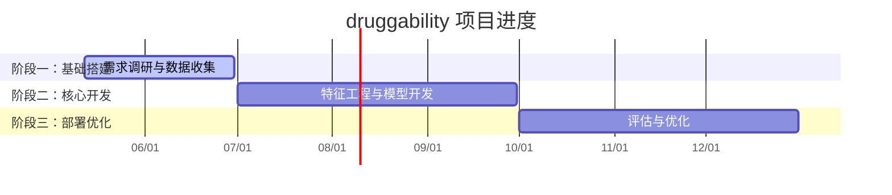

# 💊 druggability – 靶点成药性评估

| 属性 | 值 |
|------|------|
| **状态** | 🟢 进行中 |
| **负责人** | QYJI |
| **源码仓库** | [HitJay/druggability](https://github.com/HitJay/druggability) |
| **本地路径** | `/home/QYJI/das/druggability` |
| **启动时间** | 2026-05 |
| **目标完成** | 2026-12 |

---

## 📝 项目简介

靶点成药性（druggability）评估与建模系统。通过整合靶点结构、功能、通路等多维特征，构建成药性评分与预测模型，辅助药物研发早期靶点筛选决策。

### 技术栈

- **数据处理**：Python（pandas, scikit-learn）
- **建模**：机器学习 / 深度学习
- **可视化**：matplotlib / plotly
- **数据库**：待定

---

## 🎯 里程碑



---

## 📈 进度更新

<!-- 按时间倒序记录，最新的在前面 -->

### 2026-05 (W20)

- 项目启动，初始化仓库结构
- 创建 README、.gitignore、基础目录骨架
- 在 Pulse 仪表盘登记项目

---

## 📁 关键文件

```
druggability/
├── README.md
├── data/               ← 数据目录
├── src/                ← 源代码
├── notebooks/          ← Jupyter notebooks
├── tests/              ← 测试
└── results/            ← 输出结果
```

---

## 🔗 相关资源

- 结构化元数据：[`projects/druggability/meta.yaml`](https://github.com/HitJay/pulse/blob/main/projects/druggability/meta.yaml)
- 里程碑数据：[`projects/druggability/milestones.yaml`](https://github.com/HitJay/pulse/blob/main/projects/druggability/milestones.yaml)
