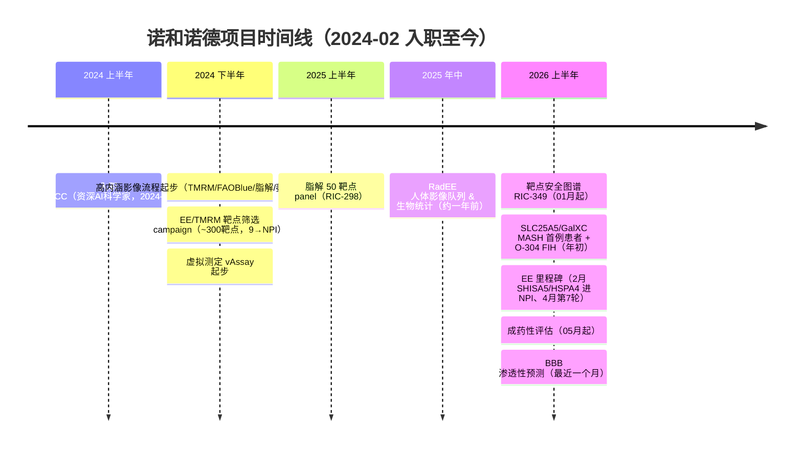

# 诺和诺德 · 项目时间线（个人职业记录）

> **目的**：按**时间维度**记录在诺和诺德参与的各条工作线，便于随年资增长区分阶段、回溯贡献、随时更新简历。
> （现有简历按「能力方向」组织，本文件补上「什么时候做的」这一维度。）
>
> **任职**：资深 AI 科学家 · AI & Digital Innovation / Research Informatics China（NNRCC，北京）· **2024-02 至今**
>
> **维护**：每当新项目立项或达成里程碑，在「时间线总览」追加一行并更新「分阶段说明」。

**时间确定性图例**：✅ 已确认（工作区/Jira 记录 + Jay 2026-06-10 确认）　｜　◐ 待细化（精确月份/时段待补）

---

## 一、时间线总览

| 时期 | 方向 / 项目 | 起讫 | 确定性 | 关键产出 / 里程碑 | 关联 |
|---|---|---|---|---|---|
| 2024 H2– | **高内涵影像分析与流程** | 2024 下半年起 · 持续 | ✅ | TMRM / FAOBlue / 脂解 / 肌管萎缩 / Seahorse；~6×96 孔板/月；白盒局部自适应阈值流程；统筹 24 条 pipeline（8 类）；**关键里程碑落在 2026** | — |
| 2024 H2–2026 | **EE / TMRM 靶点筛选 campaign** | 2024 下半年 → 持续 | ✅ | 高内涵 TMRM 筛 ~300 靶点（#31/#24/#22 = 175、EE = 117、3′aQTL = 8）；**9 个推进至 NPI**（GRB14 / SIRT4 / MINDY1 / SLC22A3 等）；**里程碑落在 2026**（2 月 SHISA5/HSPA4 进 NPI、4 月第 7 轮 3′aQTL） | — |
| 2024 H2– | **细胞分割 & 细胞基础模型 · vAssay** | 2024 下半年起 · 持续 | ✅ | 虚拟测定 vAssay（DINOv2+TabPFN R² 0.76；perturb-seq→TMRM R² 0.75）；升级 Cellpose-SAM（Cellpose 4）；JUMP Cell Painting 上微调 VAE / DINOv2 | — |
| 2025 H1 | **脂解 50 靶点 panel** | 2025 年初 | ✅ | 脂解 panel；免疫/肿瘤/CVD 关键词标记 | RIC-298 |
| ~2025 年中 | **RadEE / 人体影像队列 & 生物统计** | 约一年前（~2025-06）→ 持续 | ✅ | RadEE 工具包（DXA PDF→表、MRI DICOM→NIfTI、全身脂/水影像组学）；DoE / 功效分析（FSTL1 N=4→N=15）；STOmics、3′aQTL | — |
| 2026 H1 | **靶点安全图谱（safety tool）** | 2026-01-15 → 2026-09-30（目标） | ✅ | ~1000 个肥胖/T2D 靶点筛查；整合 10 源 harness；vLLM+Docker 35B（QW35B）@A100；登记表/检索工具（169 靶点 / 300 靶点-方向对，RED/YELLOW/GREEN） | RIC-349 |
| 2026 年初 | **SLC25A5 / GalXC（MASH 首次人体给药）** | 2026 年初（FIH） | ✅ | 影像 + MoA 分析助推 **GalXC-SLC25A5**（肝细胞线粒体解偶联，MASH 首例患者）与 AMPK 激活剂 **O-304** 至 first-in-human | — |
| 2026 H1– | **成药性评估（druggability）** | 2026-05-12 → 2026-12-31（目标） | ✅ | 靶点特征工程 + 成药性评分建模 | — |
| 2026-05 起（最近） | **BBB 渗透性预测** | 2026-05 起（最近一个月） | ✅ | BrainPepPass v2（XGBoost + RDKit/mordred）、BBiPP 基准；MC4R 项目、RORα 工具化合物（SR3335/SR1001/SR1078） | — |

---

## 二、时间线图

---

## 三、分阶段说明

### 2024 下半年 · 影像 / ML 双线起步
- 2024-02 加入 NNRCC，资深 AI 科学家；**2024 下半年**起业务铺开。
- 主线为**高内涵影像分析**：搭建 TMRM、FAOBlue、脂解、肌管萎缩、Seahorse 等测定的图像分析流程，规模化支撑每月约 6 块 96 孔板；构建"白盒式"100×100 局部自适应阈值流程（对暗角/渐晕鲁棒）。
- 同期启动 **EE / TMRM 靶点筛选 campaign**（长周期，累计 ~300 靶点、9 个进 NPI）与**虚拟测定 vAssay**（影像/转录组两模态预测细胞功能，R² 0.76 / 0.75）。

### 2025 · 拓展
- **2025 年初**：脂解 50 靶点 panel（RIC-298），含免疫/肿瘤/CVD 关键词标记。
- **约 2025 年中**（一年前）：**RadEE** 人体影像队列影像组学与生物统计（DoE、功效分析 FSTL1 N=4→N=15、STOmics、3′aQTL）。
- 细胞/细胞核分割升级至 **Cellpose-SAM**；参与训练**细胞基础模型**（JUMP Cell Painting，VAE / DINOv2）。

### 2026 · 系统化与管线推进
- **2026-01** 启动**靶点安全图谱**自动化流程（RIC-349，目标 09-30 交付）；2026-06-08 安全管线战略 brainstorm。
- **2026 年初**：**GalXC-SLC25A5 达成 MASH 首例患者（first-in-human）**，AMPK 激活剂 **O-304** 同步推进。
- **2026 上半年** EE campaign 里程碑：2 月 SHISA5/HSPA4 进 NPI、4 月第 7 轮 3′aQTL。
- **2026-05** 启动**成药性评估**项目（目标 12-31）。
- **2026-05/06（最近一个月）** 建立 **BBB 渗透性预测**能力（BrainPepPass v2；MC4R、RORα 工具化合物）。

---

## 四、待细化的小项（主锚点已由 Jay 于 2026-06-10 确认）

1. **GalXC / O-304 FIH** 的具体月份（目前记为「2026 年初」）。
2. **Cellpose-SAM 升级 / 细胞基础模型** 的精确时段（目前归入 2024 H2– ML 线）。
3. **EE 第 7 轮 3′aQTL** 是否已于 2026-04 完成（目前记为「4 月」）。

---

## 五、简历用 · 带时间的简版（确认后即可粘贴）

- **2024 H2 –**　高内涵影像分析与流程（TMRM/FAOBlue/脂解/萎缩/Seahorse，~6 板/月，24 条 pipeline）
- **2024 H2 –**　EE/TMRM 靶点筛选 campaign：~300 靶点 → 9 个进 NPI（里程碑 2026）
- **2024 H2 –**　虚拟测定 vAssay（R² 0.76/0.75）；细胞基础模型（JUMP, VAE/DINOv2）、Cellpose-SAM
- **2025 H1**　　脂解 50 靶点 panel（RIC-298）
- **~2025 年中**　RadEE 人体影像队列与生物统计（DoE、功效分析）
- **2026-01 –**　靶点安全图谱自动化（RIC-349，~1000 靶点，vLLM 35B@A100）
- **2026 年初**　SLC25A5/GalXC（MASH 首例患者）、O-304 推进至 first-in-human
- **2026-05 –**　成药性评估建模
- **2026-05 –**　BBB 渗透性预测（BrainPepPass v2）
